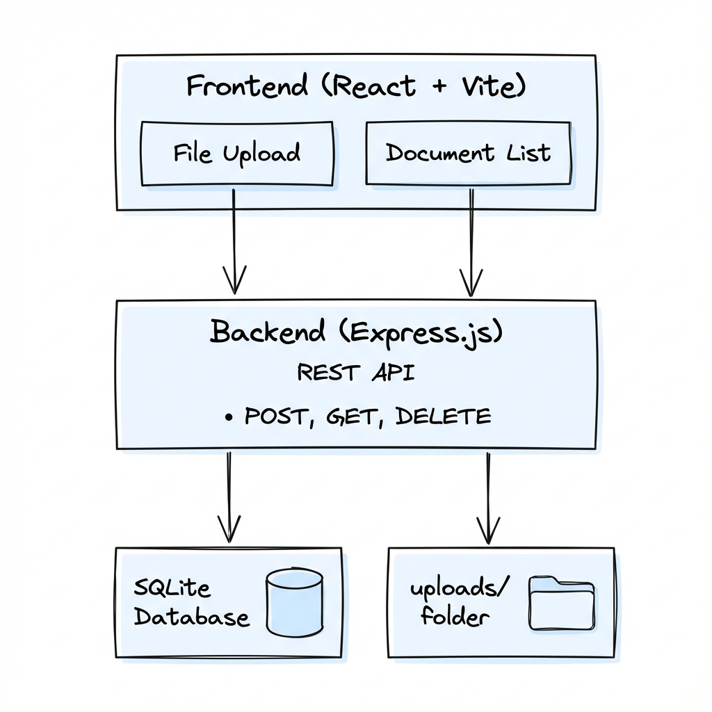

# Design Document - Medical Document Portal

## 1. Tech Stack Choices

### Q1. What frontend framework did you use and why?

**React with Vite**

I chose React because:
- **Component-based architecture**: Makes the UI modular and maintainable
- **Large ecosystem**: Well-documented with many resources for troubleshooting
- **Virtual DOM**: Ensures efficient UI updates when document list changes
- **Vite as build tool**: Provides fast hot module replacement during development

Alternative considered: Vue.js, but React has more community support and I'm more familiar with it.

---

### Q2. What backend framework did you choose and why?

**Node.js with Express**

I chose Express because:
- **Lightweight**: Minimal setup for a REST API
- **Middleware support**: Easy to add file upload handling (multer), CORS, etc.
- **Same language**: JavaScript on both frontend and backend reduces context switching
- **Good for I/O operations**: Node's async nature handles file uploads efficiently

Alternative considered: Flask (Python), but Node.js integrates better with the React ecosystem.

---

### Q3. What database did you choose and why?

**SQLite**

I chose SQLite because:
- **Zero configuration**: No database server setup required
- **File-based**: Perfect for local development
- **Simple**: The data model (single documents table) doesn't need complex relations
- **Portable**: Database is just a file that can be easily backed up

Alternative considered: PostgreSQL, but it would be overkill for this local application.

---

### Q4. If you were to support 1,000 users, what changes would you consider?

1. **Database**: Migrate to PostgreSQL for concurrent connections and better performance
2. **File Storage**: Use cloud storage (AWS S3 or Google Cloud Storage) instead of local filesystem
3. **Authentication**: Add user authentication (JWT tokens) to isolate user documents
4. **Caching**: Implement Redis for caching document metadata
5. **Load Balancing**: Deploy multiple server instances behind a load balancer
6. **CDN**: Serve static files through a CDN for faster downloads
7. **Rate Limiting**: Add request rate limiting to prevent abuse
8. **Database Indexing**: Add indexes on user_id and created_at columns

---

## 2. Architecture Overview



**Data Flow:**
- User interacts with React frontend (upload, view, download, delete)
- Frontend makes HTTP requests to Express backend API
- Backend handles file storage in `uploads/` folder
- Metadata is stored in SQLite database

---

## 3. API Specification

### POST /documents/upload

**Description**: Upload a new PDF document

**Request**:
- Method: `POST`
- Content-Type: `multipart/form-data`
- Body: Form data with `file` field containing PDF

```bash
curl -X POST -F "file=@prescription.pdf" http://localhost:3001/documents/upload
```

**Success Response (201)**:
```json
{
  "message": "File uploaded successfully",
  "document": {
    "id": 1,
    "filename": "prescription.pdf",
    "filesize": 125000,
    "created_at": "2024-12-09T10:30:00.000Z"
  }
}
```

**Error Response (400)**:
```json
{
  "error": "Only PDF files are allowed!"
}
```

---

### GET /documents

**Description**: List all uploaded documents

**Request**:
```bash
curl http://localhost:3001/documents
```

**Success Response (200)**:
```json
{
  "documents": [
    {
      "id": 1,
      "filename": "prescription.pdf",
      "filepath": "uploads/abc123-prescription.pdf",
      "filesize": 125000,
      "created_at": "2024-12-09T10:30:00.000Z"
    }
  ]
}
```

---

### GET /documents/:id

**Description**: Download a specific document

**Request**:
```bash
curl -O http://localhost:3001/documents/1
```

**Success Response (200)**:
- Returns the PDF file as binary stream with appropriate headers

**Error Response (404)**:
```json
{
  "error": "Document not found"
}
```

---

### DELETE /documents/:id

**Description**: Delete a document

**Request**:
```bash
curl -X DELETE http://localhost:3001/documents/1
```

**Success Response (200)**:
```json
{
  "message": "Document deleted successfully"
}
```

**Error Response (404)**:
```json
{
  "error": "Document not found"
}
```

---

## 4. Data Flow Description

### Q5. File Upload Flow

1. User selects or drags a PDF file onto the upload dropzone
2. Frontend validates file type (must be PDF) and size (max 10MB)
3. If valid, file is sent to backend via `POST /documents/upload` as FormData
4. Backend's multer middleware receives the file
5. Multer validates the MIME type is `application/pdf`
6. File is saved to `uploads/` folder with a unique UUID prefix
7. Document metadata (filename, filepath, filesize) is inserted into SQLite
8. Backend returns the newly created document record
9. Frontend adds the document to the list and shows success toast

### File Download Flow

1. User clicks the download button on a document
2. Frontend creates a dynamic link pointing to `GET /documents/:id`
3. Browser triggers the download
4. Backend looks up the document record in SQLite
5. Finds the file in the `uploads/` folder
6. Streams the file to the response with `Content-Disposition: attachment` header
7. Browser saves the file with the original filename

---

## 5. Assumptions

### Q6. What assumptions did you make?

1. **Single User**: No authentication is needed; all documents belong to one user
2. **File Size Limit**: 10MB maximum per file to prevent server overload
3. **PDF Only**: Only PDF files are accepted as medical documents
4. **Local Storage**: Files are stored locally in the `uploads/` folder (not cloud storage)
5. **No Encryption**: Files are stored without encryption (would add in production)
6. **Unique Filenames**: UUID prefix ensures no filename collisions
7. **Sequential IDs**: Document IDs auto-increment (acceptable for single-user system)
8. **No Pagination**: Document list loads all documents at once (sufficient for small datasets)
9. **Browser Compatibility**: Modern browsers with ES6+ support
10. **Local Development**: Both frontend and backend run on localhost
